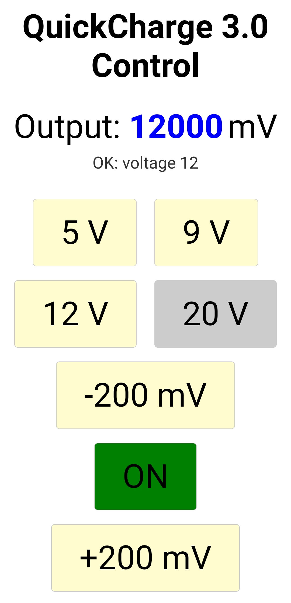

# ESP32_QC3_CTL

ESP32用のQuickCharge 3.0制御ライブラリです。

このリポジトリには、M5Stack ATOM S3向けのWebUIサンプル（APモードで操作）も含まれます。

## ハードウェア設計情報

本プロジェクトで使用するハードウェア設計情報はOSHWLabで公開しています。

[QuickCharge adapter for M5ATOMS3](https://oshwlab.com/tomorrow56/m5atom_lipo_copy_copy)

## インストール

- Arduino IDEのスケッチブックフォルダ配下の`libraries`に、この`ESP32_QC3_CTL`フォルダを配置してください。

## 使い方

- `#include <ESP32_QC3_CTL.h>`
- `ESP32_QC3_CTL qc3(dp_h, dp_l, dm_h, dm_l, vbus_det, out_en);`
- `qc3.begin();`

`addAdcPin(pin, attenuation)`で任意のADC pinを登録すると、`begin()`でatten設定を自動適用します。

## ライブラリAPI仕様（ESP32_QC3_CTL）

### 列挙型

- `QC_STATE`
  - `QC_HIZ` / `QC_0V` / `QC_600mV` / `QC_3300mV`
  - D+/D-の印加状態
- `HOST_PORT_TYPE`
  - `BC_NA` / `BC_DCP` / `QC3`
  - 接続されたポート種別
- `QC_VOLTAGE_MODE`
  - `QC_5V` / `QC_9V` / `QC_12V` / `QC_20V` / `QC_VAR`
  - VBUS出力設定モード

### コンストラクタ

- `ESP32_QC3_CTL(uint8_t dp_h, uint8_t dp_l, uint8_t dm_h, uint8_t dm_l, uint8_t vbus_det, uint8_t out_en = 0)`
  - **dp_h/dp_l/dm_h/dm_l**: D+/D-制御用GPIO
  - **vbus_det**: VBUS検出（ADC）GPIO
  - **out_en**: 出力ON/OFF制御GPIO（未使用の場合は`0`）

### 初期化

- `bool begin()`
  - ピン初期化、ADC分解能設定、登録済みADCピンのatten設定適用などを行います。
  - **戻り値**: 成功時`true`

### 充電器（ポート種別）の検出

- `uint8_t detect_Charger()`
  - BC1.2 DCP/QC3.0の判定を行います。
  - **戻り値**: `BC_NA` / `BC_DCP` / `QC3`
  - **注意**: 内部でD+/D-の状態を変更します。QC3検出時にClass B判定のため一時的に20V設定を試行します。

### 電圧設定

- `bool set_VBUS(uint8_t mode)`
  - VBUSの出力電圧モードを設定します。
  - **mode**: `QC_5V` / `QC_9V` / `QC_12V` / `QC_20V` / `QC_VAR`
  - **戻り値**: 設定成功で`true`
  - **注意**: `detect_Charger()`で`QC3`と判定された場合に有効です（QC3以外では`false`を返します）。

### 可変モード（QC_VAR）

- `void var_inc()`
- `void var_dec()`
  - `QC_VAR`モード時に200mV刻みで増減します。
  - **注意**: `QC_VAR`以外では何もしません。

### 取得系

- `uint16_t getVoltage()`
  - 現在のVBUS設定値を返します。
  - **単位**: mV
  - **注意**: 実測値ではなく「設定値」です。実測は`readVoltage(vbus_det)`等で取得してください。

- `uint8_t getHostType()`
  - `detect_Charger()`結果のホストタイプを返します。

- `bool getUseClassB()`
  - Class Bを使用するかどうかの内部判定結果を返します。

### ADC/電圧読み取り

- `float readVoltage(uint16_t Vread)`
  - ADC生値を電圧(V)へ変換します。

- `float readVoltage(uint8_t pin, uint16_t Vread)`
  - 指定pinに対応するADC生値を電圧(V)へ変換します。

- `float readVoltage(uint8_t pin)`
  - `analogRead(pin)`して電圧(V)を返します。

**注意（ESP32コア/IDF差分）**:
環境（Arduino-ESP32コアのバージョン）によりADC較正APIが利用できない場合があるため、一部環境では単純換算にフォールバックします。

### ADCピン登録

- `bool addAdcPin(uint8_t pin)`
- `bool addAdcPin(uint8_t pin, uint8_t attenuation)`
  - `begin()`時にatten設定を自動適用するための登録です。
  - **attenuation**: ESP32環境では`ADC_11db`等（Arduino-ESP32の`adc_attenuation_t`相当）
  - **戻り値**: 登録成功で`true`

### D+/D-直接操作

- `void set_DP(uint8_t state)`
- `void set_DM(uint8_t state)`
  - D+/D-を`QC_STATE`相当の状態へ設定します。
  - **注意**: 通常は`set_VBUS()`/`detect_Charger()`経由での利用を想定しています。

## AtomS3_QC3_WebUI（WebUIサンプル）

`examples/AtomS3_QC3_WebUI/AtomS3_QC3_WebUI.ino` は、ATOM S3がアクセスポイント(AP)を立ち上げ、ブラウザから出力電圧とON/OFFを操作できるサンプルです。

### 接続

- ATOM S3が起動したらWi-Fiで `ATOMS3_AP` に接続
- ブラウザで `http://192.168.4.1/` にアクセス

### ピン定義

`examples/AtomS3_QC3_WebUI/PinDefinitions.h` を参照してください。

### HTTPエンドポイント

- `/` : WebUI
- `/voltage?value=5|9|12|20` : 固定電圧
- `/offset?value=200|-200` : 可変モード(QC_VAR)で±200mV
- `/toggle?state=on|off` : 出力ON/OFF
- `/state` : 現在の出力ON/OFF状態（`on`/`off`）
- `/current` : 出力電圧の実測値（VBUS_DETのADC読み取りから算出したmV）
- `/use_class_b` : Class B使用可否（`true`/`false`）

### 出力電圧（実測）の注意

`/current` は `VBUS_DET` のADC電圧に分圧比を掛けてVBUS(mV)を算出します。
サンプルでは抵抗分割を `100kΩ/15kΩ` として補正係数 `7.67` を使用しています。
分圧抵抗が異なる場合は、`examples/AtomS3_QC3_WebUI/WebUI.cpp` の係数を環境に合わせて変更してください。

### ATOM S3 本体ボタン

本体ボタン（`BtnA`）押下で出力ON/OFFをトグルします。
WebUI側は `/state` を定期的に取得して表示を同期します。

### 起動直後のOUT_ENグリッチ

起動直後に `OUT_EN` が一瞬ONになる現象を軽減するため、`setup()`冒頭で `INPUT_PULLDOWN` を経由してLOWへ固定してから出力化しています。
ブートローダ段階の挙動まで含めて完全に抑止したい場合は、`OUT_EN` にプルダウン抵抗を追加する等のハード対策も検討してください。

## examples

- `examples/DetectCharger/DetectCharger.ino`
- `examples/AtomS3_QC3_WebUI/AtomS3_QC3_WebUI.ino`
